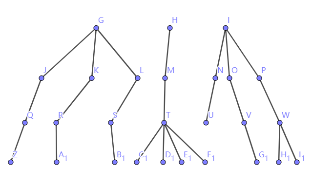
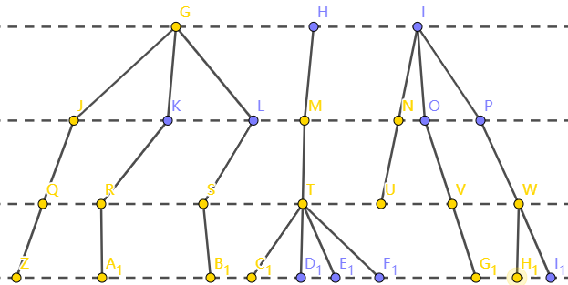
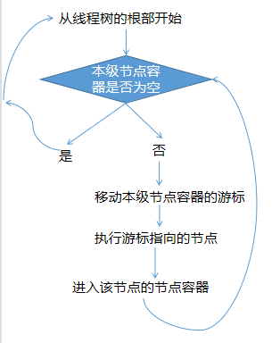
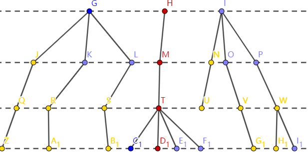
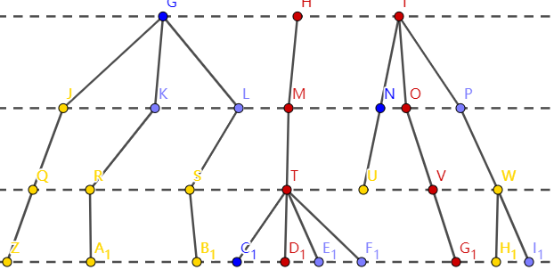

# 算法

与算法相关的函数有[TThreadPool::run](technicalDetails/TThreadPool/functions/run.md)
和[nodeC::getNodeLower](technicalDetails/nodeC/functions/getNodeLower)
和[TTNode::maintain](technicalDetails/TTNode/functions/maintain.md)

线程树是一般的树，如图  

每个节点容器都有一个用于指示下一个迭代的节点的游标（黄点），如图

系统线程的流程图如图所示  

第一次外循环（红色表示被执行过的）  

第二次外循环（红色表示被执行过的） 

**反复执行，可以起到不完全遍历的效果，且节点中的每个子树分配的资源相同**
-----
彻底执行完的线程节点会被移除，没有子节点的线程节点会被执行回调函数（通常用来回收资源）